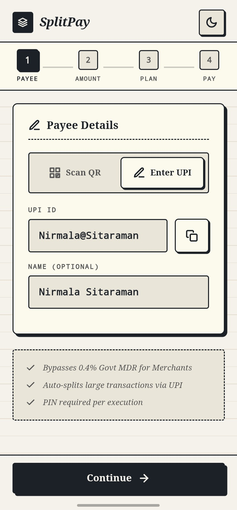
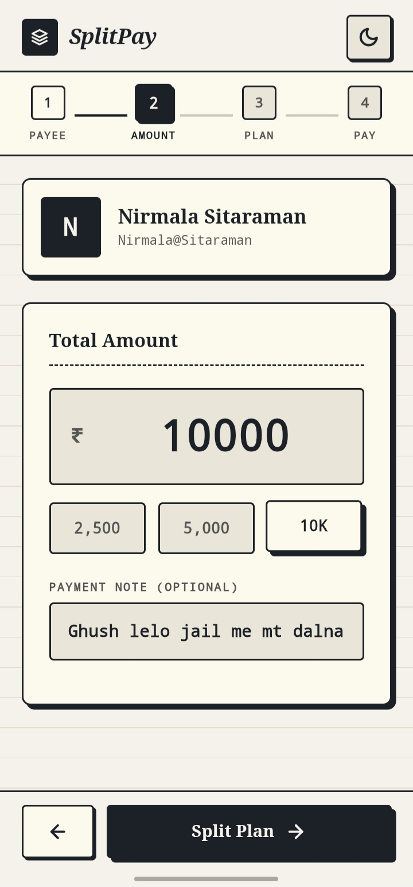
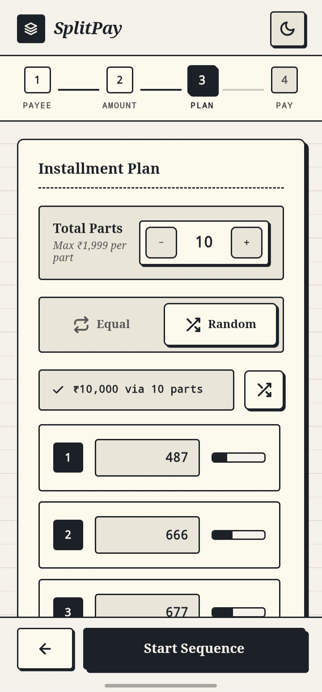
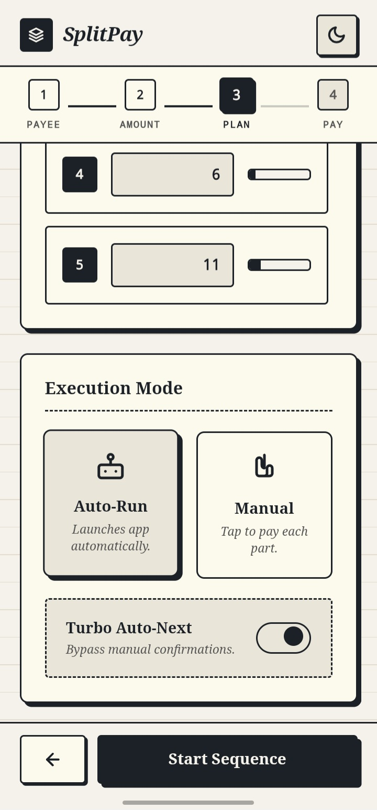
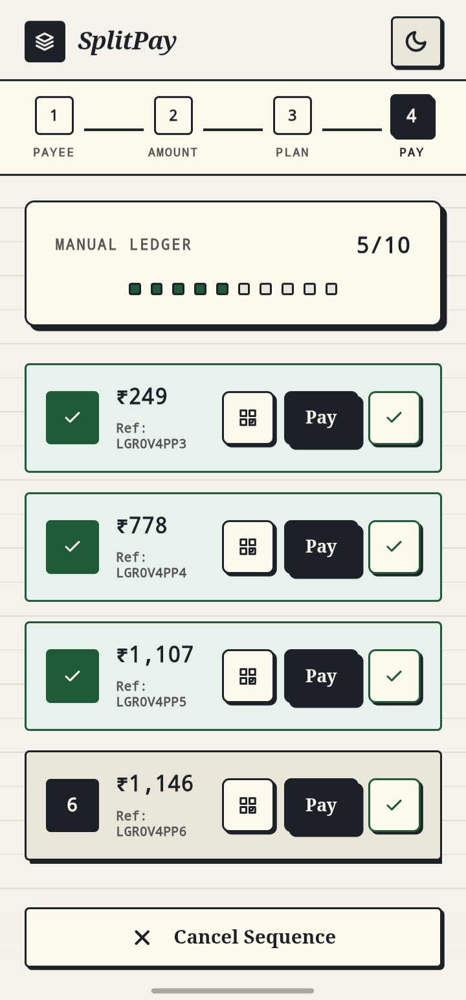
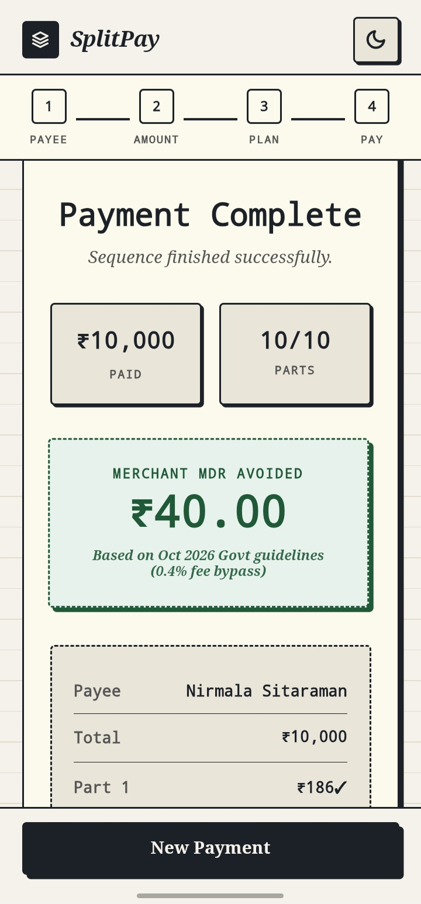

# SplitPay — Android App

> Smart UPI installment splitter. Split large UPI payments into parts of ≤ ₹1,999 — under the 0.4% MDR threshold for merchants — and run them as a guided sequence. Merchants can also bundle up to 12 UPI accounts into one QR so a SplitPay payer's parts land across all of them.


**SplitPay is free and open source.** No ads, no tracking, no backend, no account.


## 📸 Screenshots

<table>
  <tr>
    <td align="center"><br><sub><b>1.</b> Payee — scan or type a UPI ID</sub></td>
    <td align="center"><br><sub><b>2.</b> Amount — quick chips &amp; note</sub></td>
    <td align="center"><br><sub><b>3.</b> Plan — equal or random split, per-account routing</sub></td>
  </tr>
  <tr>
    <td align="center"><br><sub><b>4.</b> Execute — auto-run / manual</sub></td>
    <td align="center"><br><sub><b>5.</b> Done — receipt &amp; sharing</sub></td>
    <td align="center"><br><sub><b>6.</b> Receive mode — one QR for up to 12 accounts</sub></td>
  </tr>
</table>


---

## 📱 What the App Does

**Pay mode** (default):
- **Scan or enter** any UPI ID / QR code (live camera, photo, or gallery) — including a SplitPay merchant QR (see Receive mode below)
- **Auto-splits** large amounts into ≤ ₹1,999 parts (equal or randomized, no two random parts share an amount)
- **Auto-Run mode** — sequences payments automatically, with a Turbo back-to-back option
- **Manual mode** — review and confirm each part individually
- **Show-QR fallback** — generates a payment QR for any part, scannable from a second device/app
- **Custom native popups** — pen-and-paper styled dialogs (light + dark)
- **Receipt sharing** — copy, or share via WhatsApp / any installed app
- **MDR savings calculator** (0.4% rule, capped at ₹300, for totals over ₹2,000 — see NPCI's current guidance for the applicable numbers)

**Receive mode** (new):
- A merchant adds up to **12 UPI IDs** and gets back **one QR**.
- Any ordinary UPI app scanning that QR pays only the **first (primary)** account — it's a completely standard `upi://pay?...` link with one extra, harmless query parameter.
- A SplitPay payer scanning it sees every account and can spread their split across them, with a balanced default assignment and per-part manual override.
- The merchant's business name and account list are saved on-device so the QR doesn't need regenerating each time.

---

## ⬇️ Install

1. [](https://github.com/keshria-hacker/SplitPay-Android/releases/latest/download/SplitPay-BETA.apk)

   *or* Grab the latest APK from the [Releases](../../releases) page,

   *or* build it yourself (see [Build Instructions](#-build-instructions)).

2. Allow "Install from unknown sources" for your browser/file manager if prompted.

3. Make sure at least one UPI app (GPay / PhonePe / Paytm / BHIM) is installed.

---

## 🧱 Tech Stack

| Layer | Technology | Why |
|-------|-----------|-----|
| Language | **Kotlin** (JVM 17) | Native Android, single-activity design |
| UI Shell | **WebView + WebViewAssetLoader** | UI ships as a local web app served from `https://appassets.androidplatform.net` (secure origin: camera, clipboard APIs work) |
| UI (web) | Vanilla **HTML/CSS/JS**, zero frameworks, ~16 small modules | No build step for the UI — see [Code Map](#-code-map) for the breakdown |
| QR decode | **jsQR 1.4.0** (bundled locally, attribution intact) | Offline scanning, no CDN dependency |
| QR generate | **qrcode.min.js** (bundled locally) | Payment QR fallback + merchant Receive-mode QR — vendored from [qrcodejs](https://github.com/davidshimjs/qrcodejs) (MIT), attribution header intact |
| Native dialogs | **Material Components** theme + custom XML popups (`dialog/AppDialog.kt`) | Brand-consistent, DayNight aware |
| Build | **Gradle 9.6.0 / AGP 9.4.1 / Kotlin 2.2.10 / ViewBinding** | |
| Min SDK | **24** (Android 7.0) | Covers the large majority of Indian devices |
| Target SDK | **36** (Android 16) | Required for Play Store submissions/updates since Google's Aug 31, 2026 target-API deadline; `compileSdk` is pinned to 37, the max AGP 9.4.x supports |

**No network backend.** The app makes zero outbound HTTP requests; UPI deep links go through the Android intent system, not HTTP. All history/preferences/merchant-account data lives in the WebView's `localStorage`, on-device only. (Fonts are self-hosted under `assets/fonts/` for exactly this reason — see Recent Changes.)

---

## ⚙️ How the App Works — Flow

### Pay mode

```
┌────────────┐   ┌────────────┐   ┌────────────┐   ┌────────────┐   ┌──────────┐
│ 1. PAYEE   │──▶│ 2. AMOUNT │──▶│ 3. PLAN    │──▶│4. EXECUTE │──▶│ 5. DONE  │
│ scan/type  │   │ + chips    │   │ equal/rand │   │ auto/manual│   │ receipt  │
│ UPI ID     │   │ + note     │   │ + accounts │   │ turbo/pause│   │ + share  │
└────────────┘   └────────────┘   └────────────┘   └────────────┘   └──────────┘
```

**Step 1 — Payee.** Scan a UPI QR with the camera (a `setTimeout`-driven jsQR loop on a downscaled 480px frame, ~8 fps to save CPU/battery) or pick from gallery/photo, or type a UPI ID. Scanned `pa=`/`pn=` fields are validated and length-capped. If the scanned QR is a SplitPay merchant QR (see Receive mode), every account it carries is picked up here too.

**Step 2 — Amount.** Amount input is sanitized (integer rupees, capped at ₹10,000). Quick chips (2,500 / 5,000 / 10K) highlight when matching.

**Step 3 — Plan.** The app computes the **minimum number of parts** `⌈total / 1999⌉`; you can raise it (max 200). Choose **Equal** or **Random** amounts, edit any part inline, and the sum-check bar turns green only when `Σ parts === total` and every part is within `[₹1, ₹1,999]`. **If the payee is a multi-account merchant**, each part also gets a receiving-account picker, defaulting to a balanced-by-amount assignment across all the merchant's accounts (biggest parts placed first, always onto whichever account has received the least so far); a "one part per account" shortcut and per-part manual overrides are both available.

**Step 4 — Execute.**
- *Auto-Run*: builds a `upi://pay?...` link per part — routed to the part's assigned account for multi-account merchants — and sets it as the "Open UPI App" link's `href`; navigating that link is intercepted by `SplitPayWebViewClient.shouldOverrideUrlLoading` and handed to `launchUpiIntent()`, which opens the installed UPI app. When you return, `visibilitychange` (+ a native `onVisReturn()` nudge from `MainActivity`) triggers the confirm sheet. **Turbo** chains parts back-to-back; otherwise a 3-2-1 countdown runs. You can **Pause**, **Skip**, **Mark Done**, **Show QR**, or **Retry** any part.
- *Manual*: a ledger list where each part unlocks only after the previous one is marked paid/failed — each row shows its destination account (for multi-account merchants) and has Pay / Show-QR / Done actions.

**Step 5 — Done.** Receipt with per-part ✓/✕ and destination account, MDR savings card, share or copy.

### Receive mode

```
┌──────────────────┐        ┌──────────────────┐
│ ACCOUNTS         │──────▶│ QR                │
│ name + up to 12   │       │ one QR, all      │
│ UPI IDs (add/scan/│       │ accounts encoded,│
│ paste, reorder)   │       │ share/print      │
└────────────────── ┘       └──────────────────┘
```

Add a business name and up to 12 UPI IDs (typed, pasted several at once, or scanned from an existing QR), pick which one is primary, then generate. The QR is `upi://pay?pa=<primary>&pn=<name>&cu=INR&spx=<other accounts, `~`-separated>` — a normal UPI link that any UPI app can pay, plus one extra parameter only SplitPay looks for. See [Core Algorithms](#-core-algorithms) and [SECURITY.md](SECURITY.md) for the full format and its trust properties.

---

## 🗺 Code Map

```
app/src/main/
├── AndroidManifest.xml                 # Permissions (CAMERA, VIBRATE), UPI <queries>, deep links
├── kotlin/com/splitpay/app/
│   ├── SplitPayApp.kt                  # Application: enables WebView debugging in debug builds only
│   ├── MainActivity.kt                 # Slim composition root: lifecycle, insets,
│   │                                   #   launchers, back routing, WebView setup
│   ├── dialog/AppDialog.kt             # AppDialogBuilder + showAppDialog() popups
│   ├── model/
│   │   ├── AppEvent.kt                 # Sealed events the bridge dispatches into Kotlin
│   │   └── SplitPart.kt                # Typed representation of one installment
│   ├── bridge/AndroidBridge.kt         # JS→Kotlin: clipboard, share, UPI, prefs, popups
│   ├── util/
│   │   ├── Extensions.kt               # isValidUpi(), callJs(), toast helpers, AndroidStringEncoder
│   │   ├── PreferenceManager.kt        # SharedPreferences wrapper (theme, turbo default)
│   │   └── UpiLinkBuilder.kt           # Validated upi://pay link construction (native side)
│   └── webview/
│       ├── SplitPayWebViewClient.kt    # URL routing (incl. upi:// interception), renderer crash recovery
│       ├── SplitPayWebChromeClient.kt  # camera permission, file chooser, JS dialogs
│       └── IntentLauncher.kt           # launchUpiIntent() + other external intents
├── assets/
│   ├── index.html                      # markup shell (screens + modals)
│   ├── css/styles.css                  # pen & paper theme (light + dark) + animations
│   ├── fonts/                          # self-hosted Zilla Slab + Space Mono (OFL) — see OFL-LICENSE.txt
│   └── js/
│       ├── state.js, statemachine.js   # shared app state (S) + the FSM screen-flow guard
│       ├── validator.js                # UPI ID / amount validation (single source of truth in JS)
│       ├── upiqr.js                    # UPI QR payload build + parse, incl. the multi-account format
│       ├── storage.js                  # localStorage wrapper: history, prefs, merchant profile
│       ├── screens.js, nav.js          # Pay-flow screen transitions + navigation
│       ├── split.js                    # split math + plan screen + account assignment
│       ├── runner.js                   # auto/manual execution + receipt screen
│       ├── merchant.js                 # Receive-mode UI: accounts, QR generation, sharing
│       ├── camera.js                   # QR scanning (camera + gallery upload)
│       ├── dom.js, events.js, utils.js # small shared helpers (incl. esc() for safe innerHTML)
│       ├── bridge.js                   # swaps in native (Android) behaviour when available
│       ├── jsQR.min.js                 # third-party QR *decoder*, attribution intact
│       └── qrcode.min.js               # third-party QR *encoder*, attribution intact
└── res/
    ├── layout/activity_main.xml, dialog_custom.xml   # ViewBinding-backed layouts
    ├── drawable/dialog_btn_*.xml        # popup button drawables
    ├── values(+night)/                 # light & dark colors/themes/strings
    └── xml/                            # backup rules, network security, FileProvider paths
```

### JavaScript ↔ Kotlin bridge

| JS call | Native action |
|---|---|
| `AndroidBridge.getClipboardText()` | read clipboard (bypasses gesture restriction) |
| `AndroidBridge.copyToClipboard(t)` | write clipboard on all API levels |
| `AndroidBridge.shareText(t)` | native share sheet (receipts) |
| `AndroidBridge.shareImage(base64Png, name)` | native share sheet for a PNG (merchant QR poster) — writes to `cache/share/` and hands it out via `FileProvider` |
| `AndroidBridge.hasUpiApp()` | is any UPI app installed? |
| `AndroidBridge.setThemePref(t)` / `getThemePref()` | sync theme choice to `SharedPreferences` |
| `AndroidBridge.setTurboPref(b)` / `getTurboPref()` | sync Turbo default to `SharedPreferences` |
| `AndroidBridge.showPopup(t,m,btn,icon)` | 1-button native popup |
| `AndroidBridge.showConfirmDialog(...)` / `showInputDialog(...)` | confirm/input popups; results dispatch to `onAppDialogResult(id, val)` |
| `window.appConfirm(...)` / `appPrompt(...)` | Promise wrappers for the above (web fallback: `confirm`/`prompt`) |

Two more bridge methods exist — `openUpiPayment(...)` and `openUpiLink(url)` (the latter explicitly commented `// Legacy` in the Kotlin source) — but the current UI doesn't call either: the actual payment launch goes through a plain `<a href="upi://...">` link, intercepted by `SplitPayWebViewClient.shouldOverrideUrlLoading` and handed to `launchUpiIntent()` directly, without crossing the JS bridge at all. Similarly, `requestCameraPermission()` exists on the bridge but isn't currently called from JS — camera permission is instead requested automatically via `getUserMedia()`, which `SplitPayWebChromeClient.onPermissionRequest` intercepts natively. Worth knowing before assuming a bridge method is on the live path.

---

## 🧮 Core Algorithms

### Split math (exact integer, no float drift)

```js
const MAX_PART = 1999;
getMin(total)  → Math.max(1, Math.ceil(total / MAX_PART))   // in state.js

// Equal: leftover rupees spread over the FIRST parts  (₹100/3 → 34, 33, 33)
evenParts(rem, k): base + 1 for the first (rem − base·k) parts

// Random: distinct-amount construction (O(n), no retries, no dead ends)
// Rule: NO two parts share the same amount.
//   part_i = i + x_i, x = non-decreasing random composition of
//   E = total − n(n+1)/2 with each x_i ≤ 1999 − n  ⇒ parts strictly increase.
// Feasible band for n distinct parts in [1,1999] (capped at n ≤ 200):
//   n(n+1)/2 ≤ total ≤ n(3999−n)/2   (e.g. ₹10,000 needs ≥ 6 parts)
// Guarantees: every part ∈ [1,1999], all amounts UNIQUE, Σ === total exactly.
// A Fisher–Yates shuffle randomises the ORDER of the (otherwise ascending) parts.
```

`startPay()` additionally refuses to run unless `Σ parts === total` and every part is in `[1, 1999]` — the plan screen's sum-check bar is a live view of that same guard, not a separate check that can drift from it.

### Multi-account merchant QR

```
upi://pay?pa=<primary UPI ID>&pn=<name>&cu=INR&spx=<acct2>~<acct3>~…
```

- `pa` is one ordinary, valid UPI ID — any UPI app that doesn't recognize `spx` simply ignores it and pays the primary account like any other merchant QR.
- `spx` lists the remaining accounts, `~`-separated (an unreserved URI character, so it never needs escaping and can't collide with a UPI ID's own characters). Every ID — `pa` and each entry in `spx` — is validated with the same regex used everywhere else in the app; anything that fails validation is dropped, not silently coerced into an account.
- The list is capped at **12 accounts** (`MAX_MERCHANT_UPIS` in `state.js`) and de-duplicated case-insensitively (UPI IDs aren't case-sensitive) in both `upiqr.js` (build/parse) and `merchant.js` (the accounts editor), so no code path can produce or accept more than 12.
- All of this lives in one module, `upiqr.js`, so there's a single place that turns untrusted scanned/pasted text into data the rest of the app trusts.

### Account assignment (splitting across a merchant's accounts)

When the payee has more than one account, `split.js`'s `defaultAssign()` places the largest parts first, each onto whichever account has received the least so far — a greedy balance that keeps per-account totals close without needing to search for an optimal partition. Equal-amount splits fall into a plain round-robin as a side effect of that rule; random splits stay balanced because the placement, not the amounts, is what's balanced. Any part's account can be overridden by hand afterward; changing the part *count* resets overrides back to the balanced default, since a manual pick for "part 3 of 5" has no obvious meaning once there are 4 parts.

### QR scan pipeline

Downscaled 480px frame → `getImageData` → jsQR (`dontInvert` for speed) → `UpiQr.parse()` extracts `pa`/`pn`/`am`/`spx` from `upi://` links, or a bare UPI ID, or a UPI ID buried in free text → validate → fill the form (Pay mode) or the accounts list (Receive mode, importing every account found). Torch button only appears when the camera reports a `torch` capability.

---

## 🔐 Security Model

Full detail — including the merchant QR's trust properties, exactly what's re-validated natively vs. in the WebView, and known limitations — now lives in **[SECURITY.md](SECURITY.md)**, so it can be kept accurate without drifting out of sync with this README. In short:

- **No backend, no analytics, no tracking, no account.** History, preferences, and a merchant's saved accounts live in the WebView's `localStorage` on-device (namespaced `sp_*`) — nothing is uploaded anywhere. (Earlier drafts of this README said state lives in JS memory only with nothing persisted; that no longer describes the code as written, and possibly never did — `Storage` in `storage.js` explicitly persists to `localStorage`.)
- **UPI IDs are validated twice, independently** — once in the WebView (`validator.js`) for fast feedback, and again natively (`String.isValidUpi()` in `util/Extensions.kt`) before anything is launched, so the JS layer is never the only thing standing between untrusted input and an intent.
- **XSS-hardened rendering:** any text that could have come from a scanned QR or pasted string (payee name, UPI IDs) is passed through `esc()` before touching `innerHTML`.
- **Transport:** `cleartextTrafficPermitted="false"` globally; the WebView only ever loads bundled assets over a virtual HTTPS origin; mixed content blocked.
- **FileProvider** paths are scoped to the app's own `cache/share/` (QR poster images, receipts) and `files/receipts/` — never external/shared storage.
- **Backups disabled** (`allowBackup=false` + `data_extraction_rules.xml` exclusions).

Found a vulnerability? Please see the reporting process in [SECURITY.md](SECURITY.md) rather than opening a public issue.

---

## 🛠 Build Instructions

### Prerequisites
| Tool | Version |
|------|---------|
| Android Studio | Latest stable (must support AGP 9.4.1) |
| JDK | 17+ (bundled in Studio) |
| Android SDK | API 37 (`compileSdk`) |

### Run / Debug
1. Open the project in Android Studio → wait for Gradle sync.
2. Enable USB debugging on a phone (real device recommended — UPI apps don't run on emulators).
3. ▶ Run (Shift+F10).

CLI build:
```bash
./gradlew assembleDebug     # → app/build/outputs/apk/debug/app-debug.apk
```

### Release
1. Generate a keystore (keep it safe — it's required for all future updates):
   ```bash
   keytool -genkey -v -keystore splitpay-release.jks -alias splitpay \
     -keyalg RSA -keysize 2048 -validity 10000
   ```
2. Uncomment and fill `signingConfigs.release` in `app/build.gradle.kts`.
3. Build:
   ```bash
   ./gradlew bundleRelease    # → app-release.aab  (store upload)
   ./gradlew assembleRelease  # → app-release.apk  (direct install/testing)
   ```

### Working on just the UI

The WebView UI has no build step of its own — you can iterate on it in a
plain browser:

```bash
cd app/src/main/assets
python3 -m http.server 8000
# open http://localhost:8000/index.html
```

`window.AndroidBridge` won't exist there, so `bridge.js` falls back to
`navigator.clipboard`, `navigator.share`, and `<a download>` automatically.

---

## 🤝 Contributing

Contributions are welcome! Full guidance — project conventions, what to test before opening a PR, and the safety invariants reviewers check for — now lives in **[CONTRIBUTING.md](CONTRIBUTING.md)**. The short version:

- **No new dependencies** without discussion; the UI stays vanilla HTML/CSS/JS with no build step.
- **Zero network access** stays zero — UPI goes through Android intents only, never HTTP.
- Every user-controlled string (QR scans, pasted text) must be escaped before touching `innerHTML` — see `esc()` in `utils.js`.
- Split math and the merchant QR format are safety-critical: read `split.js` and `upiqr.js` (and [CONTRIBUTING.md](CONTRIBUTING.md)'s notes on both) before changing either.

---

## 🐛 Troubleshooting

| Problem | Solution |
|---------|----------|
| Gradle sync fails | Check internet; File → Invalidate Caches |
| UPI app doesn't open | Install GPay / PhonePe / Paytm / BHIM first |
| Camera dark / no scan | Grant Camera permission; flash/torch appears only if the device supports it |
| Merchant QR looks "busy" / hard to scan | Many long UPI IDs make a dense code; Receive mode warns when this happens — try fewer or shorter IDs, or share the QR as an image and print it larger |
| `JAVA_HOME` not set (CLI builds) | Point `JAVA_HOME` at Android Studio's bundled JBR |
| Build fails on SDK | Install API 37 via Tools → SDK Manager |
| Payments get declined after a few parts | Your bank/UPI app may enforce per-day transaction-count or amount limits, or flag rapid repeat payments — use Manual mode and space them out |

---

## 📋 Technical Details

| Property | Value |
|----------|-------|
| Min Android | 7.0 (API 24) |
| Target Android | 16 (API 36) |
| Architecture | Single Activity + WebView shell + native bridge |
| UI assets | `index.html` + `css/styles.css` + ~16 JS modules (see [Code Map](#-code-map)) + bundled jsQR/qrcodejs |
| Permissions | CAMERA, VIBRATE |
| Data stored | UPI history, preferences, and merchant accounts — on-device only, in the WebView's `localStorage`; nothing is transmitted anywhere |
| License | MIT — see note at the top of this README about the `LICENSE` file |

---

## ⚠️ Disclaimer

- SplitPay is an independent, community project. It is **not affiliated with, endorsed by, or sponsored by NPCI, UPI, Google Pay, PhonePe, Paytm, BHIM, or any bank.** All product names are trademarks of their respective owners.
- MDR rules, thresholds, and caps (including the 0.4% figure and ₹300 cap shown in the savings calculator) are set by regulators and change over time. The numbers in the app are **estimates for illustration**, not financial or legal advice — please verify against current NPCI / RBI circulars.
- Splitting one payment into several means several separate UPI transactions. Bank limits, failed/pending parts, and merchant-side handling are outside this app's control. **Always verify each part in your UPI app's history.**
- A multi-account merchant QR is only as trustworthy as the accounts the merchant put into it — SplitPay validates UPI ID *format*, not account *ownership*, the same way it can't for a plain single-account UPI QR today.
- The software is provided "as is", without warranty of any kind. See [LICENSE](LICENSE).

---

## 📄 License

SplitPay is released under the **[MIT License](LICENSE)** — free to use, modify, and distribute, including commercially, as long as the copyright notice is kept.

---

<div align="center">

### SplitPay

**making large UPI payments frictionless.**

Built with ❤️ for the open-source AI community.

⭐ **If you find SplitPay useful, consider giving the project a star.**

</div>
